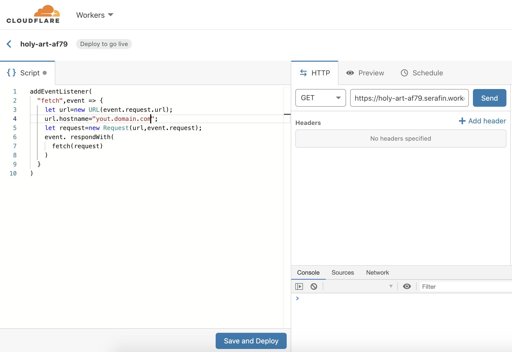

# cloudflare-worker-reverse-proxy

Reverse proxy a web page using Cloudflare worker.

```js
addEventListener(
	"fetch",event => {
		let url=new URL(event.request.url);
		url.hostname="";
		let request=new Request(url,event.request);
		event. respondWith(
			fetch(request)
		)
	}
)
```


